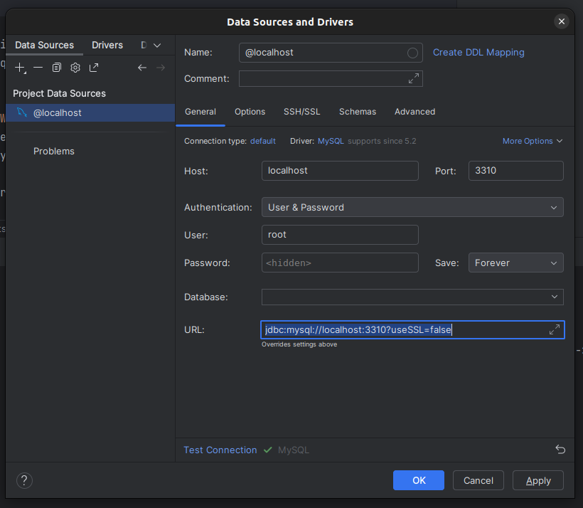

## Solución Propuesta
Este proyecto ha sido creado en contenedores docker. Con lenguaje PHP en su versión 8.3.6, 
framework Laravel version 11.6 y como gestor de base de datos MySQL.

Se ha aplicando una arquitectura en capas distribuida de la siguiente manera:

### Capa de Presentación
Se ha realizado dos capas de presentación, una a web y la otra por ejecución de comandos que serán descritos posteriormente.

### Capa Lógica
Esta capa se encuentra representada por acciones.

### Capa Persistencia
Esta capa está contenida en contratos definidos y sus respectivas implementaciones a las que se accede por medio de las acciones 
y/o controladores según sea el caso.

## Ejecución de contenedores docker

### Construcción y ejecución de contenedores docker
**Nota**: el usuario debe tener permisos de ejecución para ``docker compose`` de lo contrario ejecutar como superadministrador

```bash
docker compose up -d --build
```

### ejecución setup del proyecto
```bash
cat ./.docker/setup.sh | docker exec -i merqueo_app bash
```

## Comandos

Los siguientes comandos han sido creados para la ejecución de diferentes acciones que se describen a continuación:

### Comando para cargue masivo de equipos y jugadores

Se ejecuta el siguiente comando para crear equipos y jugadores.

```bash
php artisan app:bulk-load-command
```

### Comando para crear/armar el campeonato

Se ejecuta el siguiente comando para crear los partidos del campeonato y base de resultados.

```bash
php artisan app:create-championship-command
```

### Comando para jugar el campeonato

Se ejecuta el siguiente comando para jugar los partidos del campeonato.

```bash
php artisan app:run-championship-command
```
## Pruebas

Se han diseñado pruebas para los flujos principales así como pruebas unitarias para flujos alternos.

```bash
vendor/bin/phpunit
```


### Notas:

Se incorpora colección postman con los servicios para CRUD de módulos principales del proyecto.

link: [Merqueo Test API.postman_collection.json](docs%2FMerqueo%20Test%20API.postman_collection.json)

Configuración de conexión a mysql esto con el objetivo de ver desde la máquina anfitrión la base de datos



